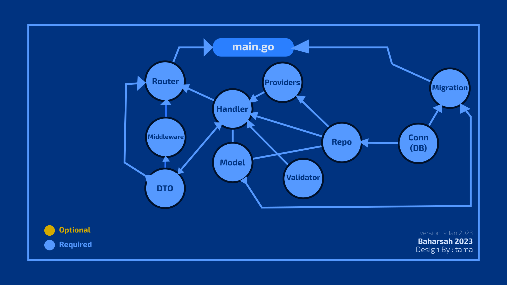

# GO API

GO API is a Template for creating simple backend.

using Gorilla Mux and Gorm With PostgreSQL Driver Dialect

# Design Pattern

# Thanks To 

 ## Corporates

[DumbWays](https://github.com/DumbWaysDotId)

## Mentors and Seniors

[Restu Wahyu Saputra (Mentor BBN)](https://github.com/restuwahyu13)

[C. Surya Elidanto (Mentor DW B42)](https://github.com/suryaa6666)

[Abel Dustin Hyman Susilo (Mentor DW B42)](https://github.com/adhxabre)

[Jody Septiawan (Mentor DW B42)](https://github.com/Jody-septiawan)

## My Friends 

[Ahmad Sidik Rudini](https://github.com/asidikrdn)

[Jaka Sianturi](https://github.com/jakasianturi)

